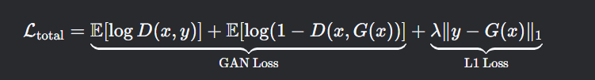
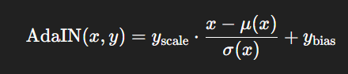
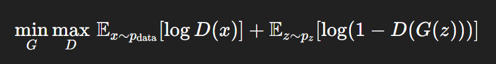
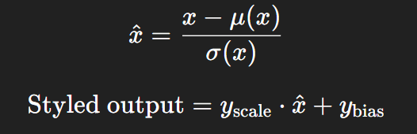

# Untitled

**What Are GANs?**

At their core, **Generative Adversarial Networks** involve two neural networks that compete with each other in a clever cat-and-mouse game. One network is the **Generator**, the “creative forger” that makes fake (but impressively real-looking) data, and the other is the **Discriminator**, the “nosy detective” whose job is to spot the fakes among real data. Their continuous battle not only pushes each to improve, but it also leads to stunningly realistic results, from deepfake videos to AI-generated art.

**Intuition Behind the Duel**

**Imagine this:**

- **Generator (The Forger):** Picture a master counterfeiter attempting to produce an exact duplicate of a famous painting—or, for a modern twist, generating hilarious cat images that blend reality and imagination in unexpected ways.
- **Discriminator (The Detective):** Now, imagine an art critic who prides themselves on never being fooled by a fake. Initially, the critic spots even the tiniest imperfections. But here's where the twist comes: as the counterfeiter hones their craft, the critic has to sharpen their skills too.

**Funny Example: The Pizza Rivalry**

Think of the generator as a pizza chef trying to create the most authentic margherita pizza possible—with every ingredient a little off at first, like using a hint of blueberry instead of basil, just to experiment. The discriminator is the discerning food critic who instantly knows something is fishy. With each review (or tasting), the chef refines the recipe until the critic can no longer tell if it’s a home-cooked imitation or the real deal. This loop of trial, error, and improvement is the heartbeat of GANs.

**Brick by Brick**

**1. Starting with Randomness**

- **The Generator Begins with Noise:** The generator doesn’t start off as a master painter—it begins with random noise. It’s like giving our pizza chef a bowl of random ingredients without a recipe and asking them to make something delicious.

**2. The First Taste Test**

- **Discriminator Makes a Call:** Once the generator outputs its “creation” (an image, a sound clip, etc.), the discriminator checks it against a set of real examples. Initially, the forgeries are laughably bad, and the critic (discriminator) is quick to call them out.

**3. The Feedback Loop: Learning Through Bickering**

- **Mutual Improvement:** Every time the discriminator catches a fake, it sends

corrective signals back to the generator. The generator then tweaks its approach. This is like the food critic giving feedback that helps the chef adjust the seasoning, step by step improving the dish.

- **Iterative Refinement:** Over many rounds, the generator gets so good at mimicking the real data that the discriminator starts to struggle—and that’s when you know something special is brewing.

**Mathssss**

1.**Discriminator’s Objective:**

The discriminator tries to maximize its ability to tell the real from the fake. Think of it as striving to earn a perfect critic’s score on every dish.

o **D(x):** This is the probability that the input (x) is real. The goal? Keep it as high as possible when the data is genuine.

2.**Generator’s Objective:**

Conversely, the generator’s goal is to minimize the discriminator’s accuracy—essentially, it wants the critic to be so confused that even fake masterpieces are applauded as genuine.

o **D(G(z)):** Here, z represents random noise, serving as the creative spark that eventually turns into art. The generator’s challenge is making D(G(z)) (the probability that the fake is real) as close to 1 as possible.

**"Why?"**

- **Why do we need a discriminator?**

Without the discriminator, the generator has no feedback mechanism. It would be like a chef cooking in isolation without anyone tasting the dish or offering suggestions for improvement.

- **Why use random noise as input?**

Random noise is the generator’s raw material. It’s akin to starting with a blank canvas or an unplanned scatter of ingredients—this randomness is refined into structured, realistic outcomes as learning progresses.

- **Why do both networks improve together?**

The beauty of GANs is in the reciprocal push for excellence. As the generator becomes better, the discriminator must adapt to stay sharp. This interplay ensures that neither gets complacent, leading to a virtuous cycle of improvement.

In this blog we will be mainly covering 2 examples/modification of GANS-

**1) Pix2Pix**

**What Makes Pix2Pix Special?**

Pix2Pix is a **"Conditional GAN" (cGAN)**—a smarter version of GANs that **translates one type of image into another**. Unlike regular GANs (which generate images from random noise), Pix2Pix needs:

**Input Image**: Your starting point (e.g., a sketch, a blurry photo).

**Output Image**: What you want (e.g., a realistic photo, a colored drawing).

**Example**:

Input: A doodle of a shoe → Output: A photorealistic shoe.

Input: A satellite map → Output: A street map.

**How Pix2Pix Works (Step-by-Step)**

**1. The Generator: U-Net (The Detail-Preserving Artist)**

Instead of a simple generator, Pix2Pix uses a **U-Net**—a neural network that keeps fine details (like edges in sketches) by copying them from input to output.

**Why U-Net?** Normal generators lose details, but U-Net’s "skip connections" preserve them.

**2. The Discriminator: PatchGAN (The Nitpicking Critic)**

Instead of judging the whole image at once, PatchGAN checks **small patches** (e.g., 16x16 pixels).

**Why?** It’s faster and produces sharper results (no blurry outputs!).

**3. The Magic: Loss Functions**

Pix2Pix combines two goals:

**GAN Loss**: Make outputs look real (fool the discriminator).

**L1 Loss**: Keep outputs close to the ground truth (avoid nonsense).

**Mathsss**:

**y**: Real target image (what we want).

**G(x)**: Generated image (what the AI made).

**λ**: Controls how much to prioritize "accuracy" over "creativity."

**Applications of Pix2Pix**

Pix2Pix turns **"what if" into "here’s how"** across fields:

1.**Art & Design**

Doodle → Painting

Fashion sketch → Photorealistic garment design 2.**Urban Planning**

Satellite images → Street maps (used in Google Maps) 

Architectural sketches → 3D building renders

3.**Medicine**

MRI sketches → Synthetic scans for training

Low-res medical images → High-res diagnostics 4.**Entertainment**

Storyboard sketches → Movie scene previews

Black & white photos → Colorized versions

**Challenges & Limitations**

1.**Paired Data Problem**

Needs **exact input-output matches** (e.g., sketch + real photo of same object). 

Solution: CycleGAN (works with unpaired data) but less precise.

2.**The Blur Dilemma**

Overusing L1 loss creates **safe but blurry** outputs.

Fix: Adjust λ or use perceptual loss for sharper edges.

3.**Bias Amplification**

Trained only on Western architecture? Outputs ignore other styles.

Always audit training data diversity.

4.**Compute Hunger**

Requires high-end GPUs for clean results.

Mobile/real-time use still challenging.

5.**Ethical Gray Zones**

Could fake documents or historical records.

Best practice: Add watermarks to AI-generated outputs.

**2) STYLE GAN**

StyleGAN has revolutionized the field of generative modelling, particularly in synthesizing remarkably realistic images. Developed by NVIDIA, this innovative Generative Adversarial Network (GAN) introduces a way to control and manipulate image features.

**1. Introduction**

StyleGAN elevates GANS approach by integrating a multi-level style control mechanism that separates the high-level structure from fine grained details, allowing unprecedented control over the image synthesis process.

**2. The Intuition**

**2.1. The Challenge with Conventional GANs**

In standard GAN architectures, the generator receives a noise vector Z and directly outputs an image. This one step mapping often limits the granularity of control over the generated images. While these models can produce realistic images, they lack the capacity to alter specific features like facial expressions or textures without affecting the overall structure.

**2.2. Introducing a “Style” Perspective**

StyleGAN reimagines image generation as a multi-layered artistic process. Instead of directly mapping noise to image pixels, it first transforms the noise into an intermediate latent space. This process can be thought of as a two-step transformation:

- **Mapping Phase:** The noise Z is transformed into a latent vector W via a learned mapping network. This latent vector represents the “style” of the image.
- **Synthesis Phase:** The generator uses this style vector to control different aspects of the image at various layers. Early layers define the overall structure (e.g., facial geometry), while later layers adjust fine details (e.g., hair texture, skin tone).

By decoupling structure and style, StyleGAN achieves a level of control that makes it possible to:

- **Interpolate between images:** Smoothly transition between different identities or attributes.
- **Style mixing:** Combine features from different sources to create hybrid images.
- **Selective editing:** Modify individual characteristics without altering the complete image.

**3. Architectural Innovations in StyleGAN**

**3.1. The Mapping Network**

The mapping network in StyleGAN converts the input noise Z into a latent code www that is less entangled and more semantically meaningful. This separation allows for more precise control over various attributes in the generated images. The mapping function f : Z→W is typically composed of multiple fully connected layers that reshape the noise distribution into a space where linear manipulations correspond to meaningful changes in image features.

**3.2. Adaptive Instance Normalization (AdaIN)**

One of the major development in StyleGAN is Adaptive Instance Normalization (AdaIN).

AdaIN injects the style information into the generator’s layers by adjusting the mean and variance of the activations. Formally, for an activation x and a style vector y (which provides a scaling factor and bias), AdaIN is defined as:

This mechanism enables each layer to adopt a specific style, ensuring that the global structure and local details are controlled separately. (But why important? Separating global structure and local details allows you to adjust high-level features (like face shape) independently from fine details (like texture), enabling creative style mixing and precise image manipulation. This disentanglement also leads to more stable training and better control over the generation process.)

**3.3. Progressive Growing and Resolution Enhancement**

StyleGAN also builds upon the idea of progressive growing, where the model starts generating low-resolution images and gradually increases the resolution as training progresses. This approach stabilizes training and improves the quality of the final high resolution output. The model’s architecture is designed to progressively add layers that refine the image, allowing the network to first focus on the overall layout before dedicating resources to finer details.

**4. Mathssss**

**4.1. The GAN Objective**

StyleGAN, like its predecessors, is trained using an adversarial objective. The generator (G) and discriminator (D) play a minimax game formulated as:

**4.2. Mapping Network and Latent Space Transformation**

The mapping network f transforms Z to W: W=f(Z)

The latent space W is designed such that simple vector arithmetic corresponds to semantic changes in the generated images (e.g., modifying W might make the subject appear older or change the hairstyle).

**4.3. AdaIN and Style Injection**

Within the synthesis network, each convolutional layer is followed by an AdaIN layer that conditions the activations on the style vector. For a given layer activation X and style parameters (Y scale,Y bias) derived from W, the AdaIN operation standardizes and then scales the feature maps:

This operation ensures that each layer’s output adheres to the desired style, enabling fine control over the image synthesis process.